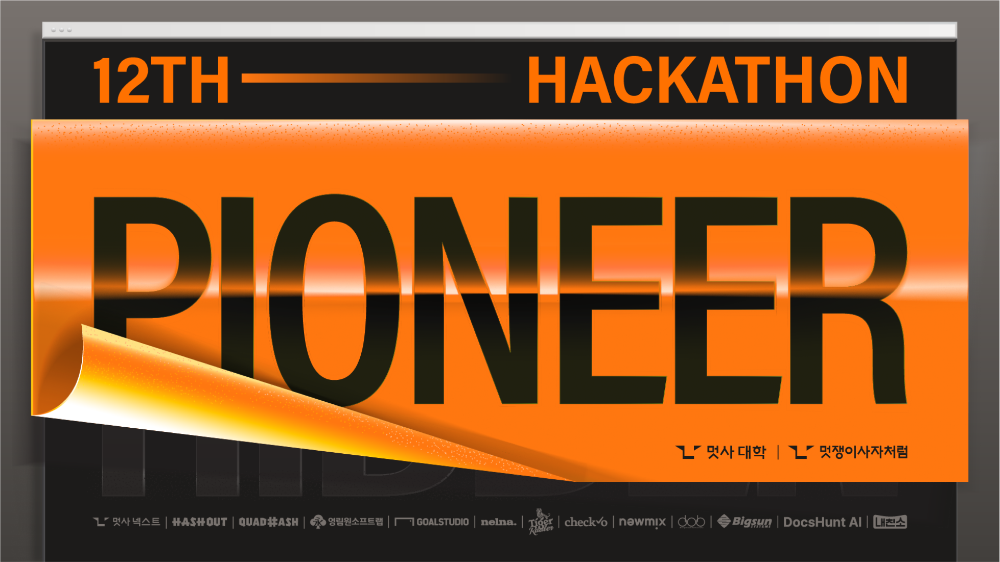
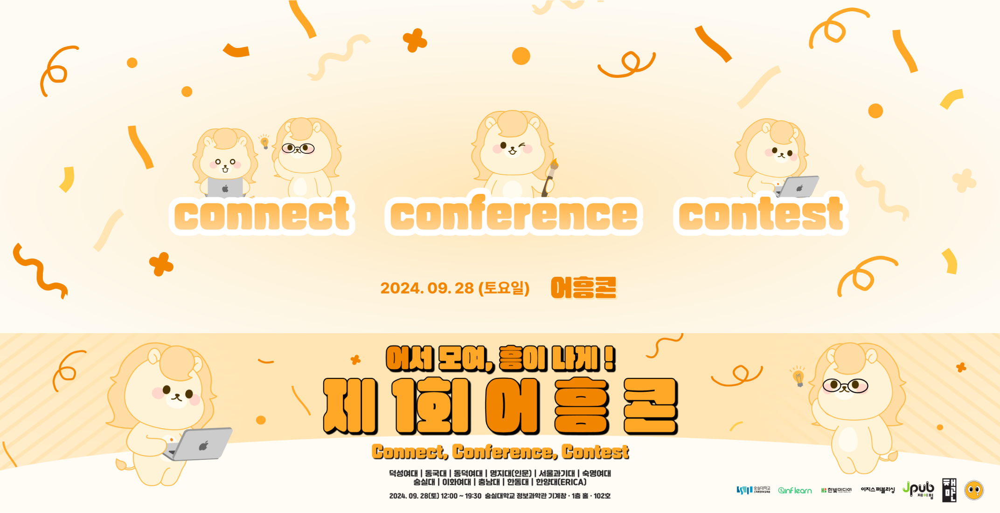

# 공공 화장실 & 흡연구역 지도 서비스, <흡변구역> - 아이고배야
**2024 [멋쟁이사자처럼 대학](https://likelion.university/) 12기 중앙 해커톤, [어흥콘](https://ryuseunghan.notion.site/2024-d3216bd249b8427caca1e38913c9238c) 출품작**

    
    

 

## Member
|[문인배](https://github.com/MoonInbae)|
|:---:|
||
| **Team Leader   Infrastructure Engineer   Frontend Developer   Backend Developer** |

|[윤윤아](https://github.com/yun-as)|[최수아](https://github.com/sooa02)|[안우섭](https://github.com/wooseobb)|[이성아](https://github.com/2SEONGA)|
|:---:|:---:|:---:|:---:|
|||||
| **Frontend Developer**| **Frontend Developer** | **Backend Developer**| **Backend Developer** |
